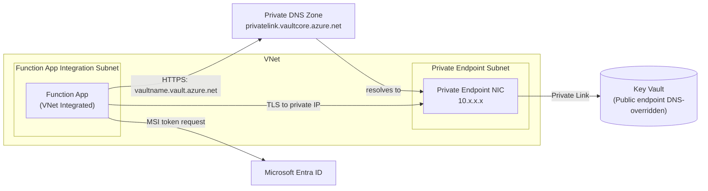
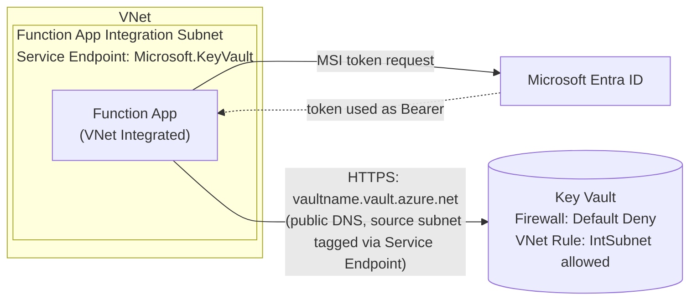
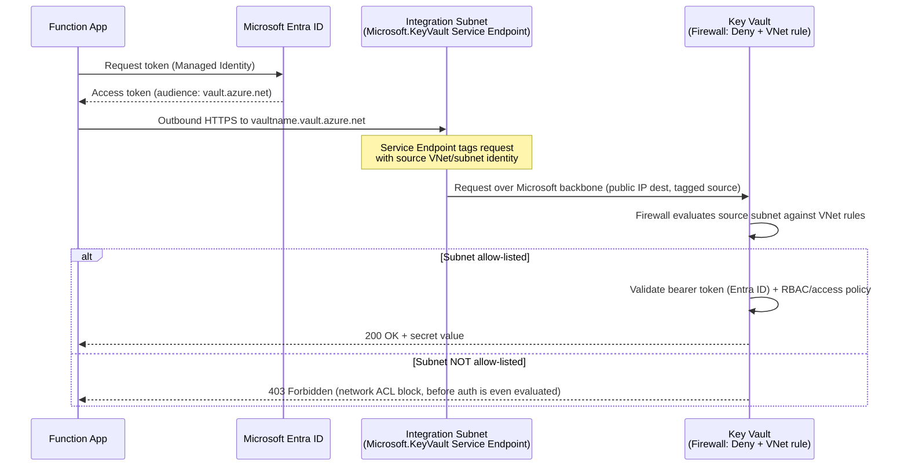

# Architecture Design

## 1. Existing Architecture

Each Function App is deployed with:
- Regional VNet Integration into a dedicated (or shared, per-environment) delegated subnet (`Microsoft.Web/serverFarms` delegation).
- A **dedicated Key Vault**, one per Function App, holding connection strings/secrets/certificates.
- A **Private Endpoint** on the Key Vault, with a NIC in a "PE subnet," and a DNS record in a **Private DNS Zone** (`privatelink.vaultcore.azure.net`) linked to the VNet(s) that need resolution.
- Key Vault **public network access effectively bypassed** by DNS (clients resolve to the private IP), often left in a permissive firewall state because the Private Endpoint was assumed to be the sole control.
- The Function App authenticates to its Key Vault using a **system- or user-assigned Managed Identity**, granted access via RBAC (`Key Vault Secrets User`) or legacy access policies.
- Infrastructure is provisioned via **Terraform**, deployed through **Azure DevOps** pipelines.

**Cost/operational footprint at current scale (hundreds of Key Vaults):**
- Hundreds of Private Endpoint NICs and private IP addresses consumed across the estate's subnets.
- Hundreds of Private DNS Zone A-records to create, and Private DNS Zone VNet links to manage as new VNets/spokes are added.
- Every new Function App/Key Vault pair requires: subnet capacity planning for the PE, a DNS record, and a Private Endpoint approval workflow (auto-approved in same-tenant scenarios, but still an extra resource to provision, tag, monitor and eventually decommission).
- Private Endpoints attract per-hour + per-GB-processed cost, multiplied by hundreds of Key Vaults.

## 2. Proposed Architecture

- Key Vault **Private Endpoints are removed**.
- The Function App integration subnet(s) get **`Microsoft.KeyVault` Service Endpoint** enabled.
- Each Key Vault's **firewall** (`network_acls`) is set to **`Default Action = Deny`**, with an explicit **VNet rule** allow-listing only the specific subnet(s) that host the Function Apps entitled to reach it.
- Managed Identity authentication to Key Vault is **unchanged** — Service Endpoints are a network-layer control; identity/RBAC remains the authorization control, exactly as today.
- Since every Function App and Key Vault already exists (this is a networking-configuration change against live resources, not a greenfield deployment), the migration itself is executed via **idempotent Azure CLI/PowerShell scripts** (`scripts/migration/`), run through the existing Azure DevOps pipeline for approval/audit trail — not by introducing a new Terraform ownership layer over resources Terraform doesn't currently manage the network configuration of. Each script snapshots the resource's current configuration to JSON before changing it, which is what rollback (§7) restores from.

Key structural differences from today:
| Aspect | Private Endpoint (today) | Service Endpoint (proposed) |
|---|---|---|
| Per-Key-Vault network resource | NIC + private IP | None — subnet property only |
| DNS | Private DNS Zone override required | Standard public DNS, unchanged |
| Traffic path | Private IP, fully isolated from Key Vault's public endpoint | Microsoft backbone, but Key Vault's public endpoint is still addressable (traffic tagged with source VNet/subnet identity, matched against firewall rules) |
| Scaling cost per Key Vault | 1 NIC, 1 private IP, 1+ DNS record | 0 additional resources (subnet flag is shared across every Key Vault using that subnet) |
| Cross-VNet/peered access | Requires DNS forwarding/peering design | Requires VNet peering + regional Service Endpoint (see §6 Risks) |
| From on-prem / non-VNet clients | Reachable if routed to the PE | **Not reachable** — Service Endpoints only tag traffic that originates inside Azure VNets with the endpoint enabled |

## 3. Security Posture Change — read this before approving

This migration is being justified on **operational overhead reduction at scale**, not on improved network isolation. Be explicit about this trade-off, per Azure Well-Architected Framework's Security pillar (workloads should have "as much isolation as is proportionate to risk," not maximal isolation regardless of cost) and per the Azure Landing Zone network security guidance, which lists Private Link/Private Endpoint as the **preferred** pattern for PaaS resource access, with Service Endpoints as an accepted alternative where the added isolation of Private Link isn't proportionate to the operational cost of running it at this scale.

**What genuinely improves over the current state:**
- Key Vault firewall moves to an explicit `Default Action = Deny` with named VNet rules, replacing an implicit "isolated by the PE + probably-permissive firewall" posture. This is enforced consistently via Azure Policy ([§7 in Design.md](Design.md#7-policy-initiative)) rather than relying on each Key Vault being configured correctly by whoever provisioned it.
- Centralized Azure Policy governance (deny-by-default, audit for drift) applies uniformly across hundreds of Key Vaults — today's PE-based estate has no equivalent policy layer described.
- Full monitoring/alerting coverage (Diagnostic Settings + Activity Log Alerts, [§5 in Design.md](Design.md#5-monitoring)) is introduced as part of this migration, which is a genuine detective-control improvement regardless of PE vs. SE.
- Removing hundreds of PE NICs/private IPs reduces the private-networking attack surface and simplifies the estate's network topology (fewer things that can be misconfigured).

**What is genuinely traded away, and must be accepted knowingly:**
- With a Private Endpoint, the Key Vault's public endpoint is not reachable at all from the public internet — traffic is fully private, end to end. With a Service Endpoint, **the Key Vault's public endpoint still exists and is still the destination** — Service Endpoints add the source VNet/subnet's identity to the request, which the Key Vault firewall then matches against its allow-list. This is a **allow-list-based network ACL**, not **network isolation**. Microsoft's own guidance is explicit that Private Link is the stronger control for exactly this reason.
- A Key Vault firewall VNet rule allow-lists a **subnet**, not a specific Function App. Any resource with network access to that subnet (any other Function App sharing it, a compromised resource in it, a misconfigured peer) can reach the Key Vault at the network layer — Managed Identity/RBAC remains the actual authorization boundary at that point, exactly as it does today, but the network layer's contribution to defense-in-depth is weaker than with a PE.
- Data exfiltration risk: Service Endpoints for Key Vault do **not** support Service Endpoint Policies (unlike Storage) — see [Design.md §3](Design.md#3-service-endpoint-policy) for the full explanation and compensating controls. This is a real, current Azure limitation, not a design choice.
- On-premises or cross-region-without-peering access patterns that worked via routed access to a Private Endpoint's private IP will **not** work over a Service Endpoint — Service Endpoints only extend from VNet subnets, not from on-prem via ExpressRoute/VPN unless traffic is proxied through an Azure VNet first.

**Recommendation to record in the change record:** this is an approved, deliberate trade of network isolation strength for operational scalability, compensated by firewall allow-listing + Managed Identity/RBAC + Azure Policy guardrails + full audit logging. It should be re-evaluated if Azure ever ships Service Endpoint Policies for Key Vault (see [Design.md §3](Design.md#3-service-endpoint-policy)), and it should **not** be applied to Key Vaults holding secrets for workloads with a materially higher sensitivity classification without a separate risk assessment — flag any such Key Vault for exclusion during discovery ([Design.md §1](Design.md#1-discovery-phase)).

## 4. Networking Flow

Two independent controls must both pass: **(1)** the Key Vault firewall must allow the source subnet, **(2)** Entra ID must issue a valid token for an identity that Key Vault RBAC/access policy has granted `Key Vault Secrets User` (or equivalent) on that specific vault. Neither control alone is sufficient — this is the defense-in-depth model this design relies on in place of network isolation.

## 5. Why Service Endpoints Are Appropriate Here

Service Endpoints are a reasonable, supportable choice specifically **because of the scale and shape of this estate**, not as a universal recommendation:
1. **1:1 Key Vault-to-Function-App ratio, hundreds of instances.** Private Endpoints multiply linearly with Key Vault count — NICs, IPs, DNS records. Service Endpoints are a **subnet-level** setting; enabling it once covers every current and future Key Vault reachable from that subnet, with zero incremental per-Key-Vault networking resource.
2. **Traffic never leaves the Microsoft backbone.** Unlike disabling the firewall entirely, Service Endpoints still route Key Vault traffic over Azure's backbone network rather than the public internet, and the firewall allow-list still requires a specific subnet identity — this is materially better than "public network access enabled, no VNet restriction."
3. **No DNS complexity.** Private DNS Zone management (creation, VNet linking across spokes/peered VNets, record lifecycle tied to PE lifecycle) is a genuine, recurring operational cost at this scale that Service Endpoints eliminate entirely — standard public DNS resolution is used unchanged.
4. **The identity boundary (Managed Identity + RBAC) does the heavy lifting either way.** Both architectures rely on Entra ID + RBAC as the actual authorization control; the network layer is a defense-in-depth addition in both cases. Service Endpoints keep a real, auditable defense-in-depth layer (subnet allow-listing) without the operational cost of Private Link at this scale.
5. **This is an accepted Landing Zone pattern**, not a bespoke exception — Microsoft's Cloud Adoption Framework lists Service Endpoints as an appropriate control for PaaS resources where Private Link's operational cost isn't proportionate to the resource's risk classification, provided firewall default-deny and monitoring are in place (both are part of this design).

## 6. Risks and Mitigations

| Risk | Impact | Mitigation |
|---|---|---|
| Subnet allow-lists a whole subnet, not a single Function App — lateral reach within the subnet | Medium | Keep Function Apps segmented into purpose-specific subnets where feasible; rely on Managed Identity RBAC as the hard authorization boundary; monitor via Diagnostic Settings for anomalous caller identities per Key Vault |
| No Service Endpoint Policy support for Key Vault → cannot restrict *which* Key Vaults a subnet can reach at the network layer (unlike Storage) | Medium-High | Compensating controls in [Design.md §4](Design.md#4-key-vault-firewall-design): strict per-subnet VNet firewall rules on every Key Vault (not just the "right" one), Conditional Access / identity-based restriction where available, and Diagnostic Settings alerting on any unexpected caller-vault pairing |
| Firewall rule change is a highly privileged operation (`Microsoft.KeyVault/vaults/write`) — misconfiguration removes protection instantly | High | Azure Policy `Deny` on Key Vaults created without `Default Action = Deny` ([Design.md §7](Design.md#7-policy-initiative)); Activity Log Alert on any Network ACL modification ([Design.md §5](Design.md#5-monitoring)); PR-gated Azure DevOps pipeline running the versioned migration scripts as the sole change path — no ad-hoc portal/CLI changes permitted post-migration |
| On-prem/ExpressRoute clients that relied on routed access to a Private Endpoint's private IP lose connectivity | High for any such client | Discovery phase ([Design.md §1](Design.md#1-discovery-phase)) must explicitly enumerate any non-VNet consumer of each Key Vault before migrating it; exclude/flag any such Key Vault from this migration pattern |
| Cross-region or non-peered VNet access patterns break (Service Endpoints don't traverse VNet peering to a different region automatically unless peered + endpoint enabled per-region as needed) | Medium | Confirm during discovery which VNets/subnets actually need access per Key Vault; if a genuinely multi-region access pattern exists, that Key Vault is a candidate for **remaining on Private Endpoint** rather than forcing Service Endpoints everywhere |
| Rollout mistake at scale (hundreds of Key Vaults) firewalled incorrectly, causing a production outage | High | Phased rollout (RolloutPlan.md) starting with a single pilot pair, validation gates between phases, and the rollback strategy below |
| Diagnostic/monitoring gap during the cutover window (old PE-based alerting decommissioned before new SE-based monitoring is confirmed working) | Medium | Monitoring ([Design.md §5](Design.md#5-monitoring)) is deployed and validated **before** any Private Endpoint is removed for a given Key Vault, per Testing.md's sequencing |

## 7. Rollback Strategy

Rollback is designed to be possible **per Key Vault**, not just at the whole-migration level, since rollout is phased:

Rollback does not rely on IaC state, since these resources' network configuration isn't Terraform-managed for this migration (§2). Instead, **every migration script snapshots the exact pre-change configuration to a timestamped JSON file** (`scripts/migration/snapshots/`) before making any change — that snapshot is the restore point.

1. **Immediate (network-layer) rollback**, if a specific Key Vault's Function App loses access after cutover:
   - Run `scripts/migration/Restore-KeyVaultFirewall.ps1 -VaultName <name> -SnapshotPath <pre-change-snapshot.json>` to reapply the exact prior `network_acls` state (either the wider VNet rule set, or as a break-glass last resort, temporarily `default_action = Allow` **only** with the Activity Log Alert expected to fire immediately — never left as a standing state).
   - If the root cause is a missing/incorrect Service Endpoint on the consuming subnet, re-add it via `scripts/migration/Enable-ServiceEndpoint.ps1` — this is non-destructive and takes effect within minutes.
2. **Full rollback to Private Endpoint** for a given Key Vault, if Service Endpoints prove unworkable for that specific workload (e.g., an undiscovered on-prem dependency surfaces):
   - Run `scripts/migration/Restore-PrivateEndpoint.ps1 -VaultName <name> -SnapshotPath <pre-removal-PE-snapshot.json>`, which recreates the Private Endpoint and its Private DNS Zone record from the exact configuration captured before it was removed.
   - Re-tighten the Key Vault firewall to `Deny` with no VNet rules (PE traffic doesn't need one).
   - This is why `scripts/migration/Remove-PrivateEndpoint.ps1` **always writes a restorable snapshot** before deleting anything, and why snapshots are retained (not cleaned up) through at least the Non-Production and initial Production phases — see RolloutPlan.md exit criteria before a subscription's snapshots are archived/purged.
3. **Pipeline-level rollback**: every change ships through the Azure DevOps pipeline (`pipelines/`), which runs the migration scripts and stores each run's snapshot as a pipeline artifact — reverting is re-running the relevant `Restore-*` script against the last-known-good snapshot artifact, not a `git revert` + reapply (there's no declarative state to reconcile against). No portal/CLI ad-hoc changes are permitted against migrated Key Vaults (enforced via Azure Policy denying changes from outside the pipeline's service principal, where feasible, and via RBAC restricting `Microsoft.KeyVault/vaults/write` on production Key Vaults to the pipeline identity).
4. **Rollback trigger criteria** (also see Testing.md "Rollback Steps" and RolloutPlan.md "Validation Gates"): secret retrieval failure rate above baseline, any unplanned `403` spike in Key Vault diagnostic logs, or any Function App cold-start/execution failure attributable to Key Vault connectivity.
