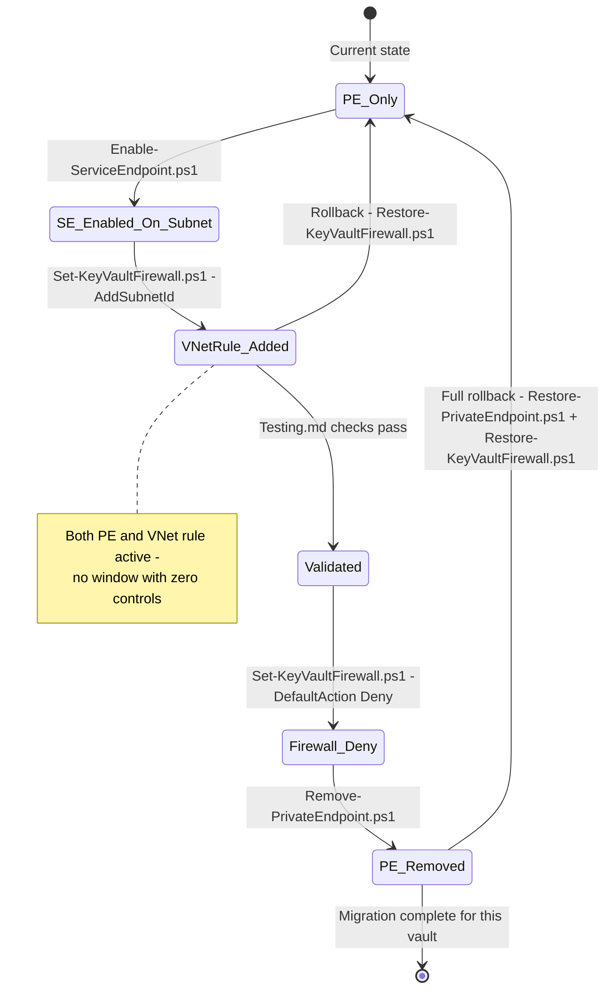

# Detailed Technical Design

Companion to `Architecture.md` (the "why"). This document is the "how": discovery, networking plan, Service Endpoint Policy analysis, firewall design, monitoring, and Azure Policy design. Actual scripts/policy JSON referenced here live in `scripts/` and `policies/`. There is deliberately no Terraform in this design — every Function App and Key Vault already exists, so this migration changes network configuration on live resources via idempotent CLI/PowerShell scripts rather than introducing a new IaC ownership layer over resources Terraform doesn't currently manage the network configuration of.

---

## 1. Discovery Phase

Before touching any Key Vault, build a complete, authoritative inventory. Do this with **Azure Resource Graph** as the primary tool (fast, cross-subscription, point-in-time consistent) and CLI/PowerShell for anything Resource Graph can't reach directly (e.g., live firewall rule detail, some diagnostic settings sub-properties).

### 1.1 What to discover

| # | What | Why it matters for this migration |
|---|---|---|
| 1 | All Key Vaults (name, RG, subscription, region, SKU, public network access, firewall default action, network ACL rules) | The full migration population and their current firewall posture |
| 2 | All Function Apps (name, RG, subscription, VNet integration subnet ID, identity type, outbound VNet routing setting) | Maps each Key Vault to the subnet(s) that need a Service Endpoint |
| 3 | Existing Private Endpoints on Key Vaults (target vault, subnet, private IP, DNS zone group) | The exact set to be decommissioned, and to confirm 1:1 mapping assumptions hold |
| 4 | VNets and Subnets (address space, existing service endpoints, delegations, NSG/route table associations) | Confirms subnet capacity/delegation compatibility before enabling `Microsoft.KeyVault` |
| 5 | Managed Identities associated with each Function App, and their Key Vault authorization - both RBAC role assignments **and** classic Access Policies (a vault can use either model independent of the other) | Confirms the identity/authorization boundary is already correctly scoped (this migration doesn't change it, but misconfigured RBAC/Access Policy would be a wrongly-timed discovery), and - critically for `Build-MigrationScope.ps1`'s join - checking RBAC alone would wrongly flag any vault still on classic Access Policies as having no matching identity |
| 6 | Current Key Vault firewall configuration in detail (bypass setting, existing IP rules, existing VNet rules) | Baseline to diff against post-migration state, and to catch any Key Vault already relying on IP-based rules that must be preserved or reviewed |
| 7 | Diagnostic settings on each Key Vault (destination, categories enabled) | Identifies gaps to close as part of this migration (Design §6) |
| 8 | Azure Policies currently assigned that touch Key Vault | Avoid conflicting/duplicate policy assignments once the new initiative (§8) is applied |
| 9 | Activity Log Alerts currently configured for Key Vault events | Same — avoid duplication, confirm gaps |

### 1.2 Resource Graph queries

```kql
// All Key Vaults with firewall posture
resources
| where type =~ 'microsoft.keyvault/vaults'
| project name, resourceGroup, subscriptionId, location,
    sku = properties.sku.name,
    publicNetworkAccess = properties.publicNetworkAccess,
    defaultAction = properties.networkAcls.defaultAction,
    bypass = properties.networkAcls.bypass,
    ipRules = properties.networkAcls.ipRules,
    vnetRules = properties.networkAcls.virtualNetworkRules,
    softDelete = properties.enableSoftDelete,
    purgeProtection = properties.enablePurgeProtection
```

```kql
// All Key Vault Private Endpoint connections
resources
| where type =~ 'microsoft.network/privateendpoints'
| mv-expand connection = properties.privateLinkServiceConnections
| where connection.properties.privateLinkServiceId contains 'Microsoft.KeyVault/vaults'
| project peName = name, resourceGroup, subscriptionId,
    subnetId = tostring(properties.subnet.id),
    targetVaultId = tostring(connection.properties.privateLinkServiceId),
    connectionState = connection.properties.privateLinkServiceConnectionState.status
```

```kql
// All Function Apps with VNet integration subnet. outboundVnetRouting requires a
// join against appserviceresources - vnetRouteAllEnabled lives on the separate
// microsoft.web/sites/config sub-resource (siteConfig), which Resource Graph does
// NOT include in the top-level `resources` properties for microsoft.web/sites.
// Reading properties.vnetRouteAllEnabled directly off `resources` always returns
// null - confirmed against a real tenant, not theoretical.
resources
| where type =~ 'microsoft.web/sites' and properties.kind contains 'functionapp'
| extend siteIdLower = tolower(id)
| join kind=leftouter (
    appserviceresources
    | where type =~ 'microsoft.web/sites/config'
    | extend siteIdLower = tolower(replace(@'/config/web$', '', id))
    | project siteIdLower, vnetRouteAllEnabled = tobool(properties.vnetRouteAllEnabled)
) on siteIdLower
| project name, resourceGroup, subscriptionId,
    vnetSubnetId = tostring(properties.virtualNetworkSubnetId),
    identityType = tostring(identity.type),
    identityPrincipalId = tostring(identity.principalId),
    outboundVnetRouting = vnetRouteAllEnabled
```

```kql
// Subnets and their current service endpoint configuration
resources
| where type =~ 'microsoft.network/virtualnetworks'
| mv-expand subnet = properties.subnets
| project vnetName = name, resourceGroup, subscriptionId,
    subnetName = subnet.name,
    subnetId = subnet.id,
    addressPrefix = subnet.properties.addressPrefix,
    delegations = subnet.properties.delegations,
    existingServiceEndpoints = subnet.properties.serviceEndpoints,
    nsg = subnet.properties.networkSecurityGroup.id,
    routeTable = subnet.properties.routeTable.id
```

```kql
// Key Vault RBAC role assignments (cross-reference with Function App identities)
authorizationresources
| where type =~ 'microsoft.authorization/roleassignments'
| extend scope = tostring(properties.scope)
| where scope contains 'Microsoft.KeyVault/vaults'
| project principalId = properties.principalId, roleDefinitionId = properties.roleDefinitionId, scope
```

```kql
// Key Vault classic Access Policy entries - a separate authorization model from RBAC
// above, checked independently since a vault can use either (or the join in
// Build-MigrationScope.ps1 would wrongly treat an Access-Policy-only vault as having
// no matching Function App identity)
resources
| where type =~ 'microsoft.keyvault/vaults'
| project vaultName = name, resourceGroup, subscriptionId, accessPolicies = properties.accessPolicies
| mv-expand accessPolicies
| project vaultName, resourceGroup, subscriptionId,
    objectId = tostring(accessPolicies.objectId),
    secretsPermissions = accessPolicies.permissions.secrets
```

Run all of the above tenant-wide with:
```bash
az graph query -q "$(cat query.kql)" --first 1000 -o table
# For >1000 rows, page with --skip-token
```

### 1.3 Azure CLI discovery (detail Resource Graph can't fully express)

```bash
# Full firewall + network ACL detail per Key Vault
az keyvault show --name <vault> --query "{name:name, defaultAction:properties.networkAcls.defaultAction, bypass:properties.networkAcls.bypass, vnetRules:properties.networkAcls.virtualNetworkRules, ipRules:properties.networkAcls.ipRules, publicNetworkAccess:properties.publicNetworkAccess}" -o json

# Diagnostic settings on a Key Vault
az monitor diagnostic-settings list --resource <vault-resource-id> -o json

# Private Endpoint connections on a specific vault
az keyvault private-endpoint-connection list --vault-name <vault> -o table

# Function App VNet integration detail
az functionapp vnet-integration list --name <app> --resource-group <rg> -o json

# Existing Activity Log Alerts scoped to a subscription
az monitor activity-log alert list --subscription <sub-id> -o table

# Policy assignments touching Key Vault (by definition display name match)
az policy assignment list --query "[?contains(displayName, 'Key Vault') || contains(displayName, 'key vault')]" -o table
```

### 1.4 PowerShell discovery (equivalent, for teams standardized on `Az`)

```powershell
# All Key Vaults across accessible subscriptions with firewall posture
Get-AzSubscription | ForEach-Object {
    Set-AzContext -SubscriptionId $_.Id | Out-Null
    Get-AzKeyVault | ForEach-Object {
        $kv = Get-AzKeyVault -VaultName $_.VaultName -ResourceGroupName $_.ResourceGroupName
        [PSCustomObject]@{
            Subscription   = $_.SubscriptionId
            VaultName      = $kv.VaultName
            ResourceGroup  = $kv.ResourceGroupName
            DefaultAction  = $kv.NetworkAcls.DefaultAction
            Bypass         = $kv.NetworkAcls.Bypass
            VNetRuleCount  = $kv.NetworkAcls.VirtualNetworkResourceIds.Count
            IpRuleCount    = $kv.NetworkAcls.IpAddressRanges.Count
            PublicAccess   = $kv.PublicNetworkAccess
            SoftDelete     = $kv.EnableSoftDelete
            PurgeProtect   = $kv.EnablePurgeProtection
        }
    }
} | Export-Csv -Path ./keyvault-inventory.csv -NoTypeInformation

# All Function Apps with VNet integration subnet
Get-AzWebApp | Where-Object { $_.Kind -like "*functionapp*" } | ForEach-Object {
    [PSCustomObject]@{
        Name               = $_.Name
        ResourceGroup      = $_.ResourceGroup
        VnetSubnetId       = $_.VirtualNetworkSubnetId
        IdentityType       = $_.Identity.Type
        IdentityPrincipal  = $_.Identity.PrincipalId
    }
} | Export-Csv -Path ./functionapp-inventory.csv -NoTypeInformation

# Existing Private Endpoints targeting Key Vault
Get-AzPrivateEndpoint | Where-Object {
    $_.PrivateLinkServiceConnections.PrivateLinkServiceId -match 'Microsoft.KeyVault/vaults'
} | Select-Object Name, ResourceGroupName, Subnet, PrivateLinkServiceConnections
```

Runnable versions of the above are in `scripts/discovery/`:
- `scripts/discovery/discover-inventory.sh` (Azure CLI + Resource Graph)
- `scripts/discovery/Discover-Inventory.ps1` (PowerShell + Az)
- `scripts/discovery/*.kql` (individual Resource Graph queries, reusable in the Resource Graph Explorer or via `az graph query`)

Discovery output is consolidated into a single CSV/JSON inventory (one row per Key Vault, joined to its Function App, subnet, and current firewall/PE state) that drives the rest of the migration — see `scripts/discovery/README.md` for the consolidation script and expected schema.

---

## 2. Networking Plan

### 2.1 Determine each Function App's integration subnet

From the discovery inventory (`properties.virtualNetworkSubnetId` on the Function App), resolve to `{VNet, Subnet, AddressPrefix, Subscription}`. Because this is a 1:1 Function-App-to-Key-Vault estate, this directly answers "which subnet(s) need the Service Endpoint for this Key Vault" — it is exactly the one integration subnet the Function App uses, unless outbound VNet routing (`vnetRouteAllEnabled` / `WEBSITE_VNET_ROUTE_ALL`) is disabled, in which case **confirm Key Vault calls actually route through the VNet integration** before assuming the Service Endpoint will take effect (if routing is off, Key Vault traffic exits via the Function App's default outbound path, not the integrated subnet, and a Service Endpoint on that subnet will have no effect — this must be corrected first).

### 2.2 Which subnets require the Service Endpoint

Build the target set as: **distinct subnets** referenced by any in-scope Function App's `virtualNetworkSubnetId`, where `vnetRouteAllEnabled = true` (or equivalent app setting) is confirmed. Because multiple Function Apps can share a subnet (common in Landing Zone spoke designs where Function Apps in the same workload/environment share an integration subnet), enabling the Service Endpoint once on that subnet benefits every Key Vault reachable from it — this is the main source of the operational-overhead reduction described in Architecture.md.

Cross-check: **does the same subnet already have other Service Endpoints enabled** (e.g., `Microsoft.Storage`, `Microsoft.Web`)? Adding `Microsoft.KeyVault` is additive — a subnet can have multiple service endpoints — but confirm no conflicting NSG rules assume a specific IP-based model that a service endpoint changes (see 2.4).

### 2.3 Does enabling Service Endpoints impact anything else on the subnet?

- **No impact on compute already in the subnet** — enabling a Service Endpoint does not change existing traffic for services that don't use it; it only affects how traffic to the specified Azure service (Key Vault) is routed and tagged.
- **Impacts route tables**: Service Endpoint traffic to Key Vault uses an **optimal route over the Microsoft backbone automatically**, bypassing any `0.0.0.0/0` UDR pointing at an NVA/firewall **unless** that UDR is deliberately intended to force inspection. If the subnet has a UDR forcing all egress through a firewall appliance for inspection/logging, **service endpoint traffic will bypass it** — this is expected Azure behavior, not a bug, and must be a conscious decision (Landing Zones commonly accept this for well-known Microsoft PaaS endpoints, but confirm against the organization's egress-inspection policy before rollout).
- **No impact to inbound traffic or NSG rules targeting other destinations** — NSG rules using the `AzureKeyVault` service tag (if already in use) continue to work as expected and are a **complementary** control, not a replacement for the Key Vault firewall's VNet rule.
- **Billing**: enabling a Service Endpoint has no direct cost; it is a subnet property, not a billable resource.

### 2.4 NSG and Route Table considerations

- **NSG**: if the subnet's NSG currently has an explicit **outbound deny** rule that would block traffic to Key Vault's public IP ranges, add an explicit **Allow** rule using the `AzureKeyVault` **service tag** (not IP ranges — service tags are maintained by Microsoft and change over time) before enabling the Service Endpoint, or confirm the existing default `AllowInternetOutBound`/backbone rules already permit it.
- **Route Table**: audit every UDR associated with the target subnet. If a UDR sends `0.0.0.0/0` (or a range covering Key Vault's public IPs) to a virtual appliance, **document this explicitly per subnet** in the migration record — Service Endpoint traffic to Key Vault will take the optimal Microsoft-backbone path instead, which may be a deliberate design choice (avoid unnecessary hairpinning through an NVA for trusted PaaS traffic) or may need review if the organization mandates full egress inspection for compliance reasons. This is a **per-subnet decision**, not a blanket assumption — capture it in the per-subnet migration checklist in Runbook.md.

### 2.5 Subnet-by-subnet migration approach

Do not enable Service Endpoints and change every Key Vault's firewall in one action across the estate. Migrate **one subnet at a time**, and within that, **one Key Vault at a time** for the first few, then batch once confidence is established:

1. Identify the subnet and its full list of dependent Key Vaults (from the consolidated inventory).
2. Enable `Microsoft.KeyVault` Service Endpoint on the subnet (non-destructive, additive — does not affect existing PE-based access).
3. For **one** pilot Key Vault on that subnet: add a VNet rule for the subnet to the Key Vault firewall (still in addition to the existing PE — both can coexist during transition), validate access (Testing.md), then remove the Private Endpoint, then set `default_action = Deny` if not already.
4. Repeat for the remaining Key Vaults on that subnet.
5. Move to the next subnet.

This order (enable SE on subnet → add firewall rule alongside existing PE → validate → remove PE) means **no Key Vault ever has a window with neither control active**, and PE removal is always the last, easily-reversible step for that specific Key Vault (see Architecture.md §7 Rollback).


*(source: `diagrams/per-vault-migration-state.mmd`)*

---

## 3. Service Endpoint Policy

### 3.1 Do Service Endpoint Policies support Key Vault?

**No.** As of this design, **Service Endpoint Policies only support Azure Storage** (`Microsoft.Storage`). There is no equivalent mechanism to restrict a subnet's Service Endpoint traffic to a specific allow-list of Key Vaults the way Service Endpoint Policies restrict Storage traffic to specific storage accounts.

**Why this matters concretely**: with a Storage Service Endpoint Policy, you can say "this subnet may only reach storage accounts X, Y, Z via its Service Endpoint, even though the Service Endpoint mechanism itself would technically allow traffic to any storage account in the region." No equivalent exists for Key Vault — once `Microsoft.KeyVault` Service Endpoint is enabled on a subnet, that subnet can present its "trusted subnet" identity to **any** Key Vault in the region that chooses to allow it via a VNet rule. The subnet itself cannot be restricted to only talk to a named allow-list of Key Vaults at the network layer.

This is a genuine, currently-unresolved gap in Azure's Service Endpoint model for Key Vault, and must be stated plainly to reviewers, not glossed over.

### 3.2 Alternative controls (since Service Endpoint Policies aren't available)

Because the restriction can't be enforced on the subnet side, it must be enforced on the **Key Vault side**, and reinforced by monitoring:

1. **Per-Key-Vault firewall VNet rules remain the primary control.** Every Key Vault only allow-lists the specific subnet(s) that legitimately need it (§2.5) — this is enforced by Azure Policy (§7) so it cannot silently drift to `Allow` or an overly broad rule set.
2. **RBAC/Managed Identity remains the authorization boundary.** Even if a workload in an allow-listed subnet reaches a Key Vault it has no business calling, it still needs a valid Entra ID token for an identity with an actual role assignment on that vault — this doesn't stop network-layer reconnaissance/probing, but it stops actual secret exfiltration without a legitimate identity.
3. **Diagnostic-driven detection compensates for the missing preventive control.** Enable full `AuditEvent` logging (§6) on every Key Vault and alert on: (a) any successful `SecretGet`/`CertificateGet`/`KeyGet` from a caller identity that is not the Key Vault's own Function App's Managed Identity, (b) any request from an unexpected subnet even if network-allowed. This turns "we can't prevent it at the network layer" into "we will detect it quickly if it happens."
4. **Keep subnets purpose-scoped.** The blast radius of the missing Service Endpoint Policy control is proportional to how many *other* things share a Function App's integration subnet. Landing Zone design should keep integration subnets scoped to a single workload/team where practical, rather than one giant shared subnet for "all Function Apps in the subscription" — this limits how much a compromised co-tenant in the subnet could even attempt to reach.
5. **Consider Private Link for any Key Vault holding materially more sensitive secrets** than the rest of the estate (see Architecture.md §3) — this gap is precisely the scenario where Private Endpoint's true network isolation earns its operational cost back. This migration should include an explicit **exclusion list** of Key Vaults deliberately kept on Private Endpoint, decided during discovery, not an afterthought.

### 3.3 Best practices given this limitation

- Treat the Key Vault firewall VNet-rule list as the security boundary of record; review it on the same cadence as firewall rule reviews for any other perimeter control.
- Never widen a Key Vault's VNet rules to a supernet/whole-VNet rule "to save time" — always scope to the specific subnet(s) actually in use; Azure Policy (§7) enforces this is at least present, but scope discipline is a process control, not something Policy alone guarantees.
- Pair this migration with Conditional Access / identity-based restrictions where the organization's Entra ID tier supports it, as an additional layer independent of network topology.

---

## 4. Key Vault Firewall Design

Target end-state for every migrated Key Vault:

```
network_acls {
  default_action             = "Deny"
  bypass                     = "AzureServices"   # see 4.3
  virtual_network_subnet_ids = [<the one integration subnet this vault's Function App uses>]
  ip_rules                   = []                 # only populated for a documented exception, see 4.4
}
public_network_access_enabled = true   # required for Service Endpoints to function - see 4.2
```

### 4.1 Default Action = Deny

Every Key Vault in scope gets `default_action = "Deny"`. This is the foundation of the design and is enforced (not just recommended) via Azure Policy `Deny` effect (§7) so it cannot be reverted outside the pipeline without breaking policy compliance and triggering an Activity Log Alert.

### 4.2 Public network access considerations

Unlike Private Endpoint (where `public_network_access_enabled = false` is typical, since the private path makes the public endpoint irrelevant), **Service Endpoints require `public_network_access_enabled = true`** — the Key Vault is still reached via its public endpoint; the Service Endpoint only tags the request's source identity, and the firewall's `default_action = Deny` + VNet rule is what actually restricts who can use that public endpoint. This is the crux of the security posture change described in Architecture.md §3: the vault is technically internet-addressable, but the firewall allow-list (backed by Azure's network-layer enforcement, not just an application-layer check) rejects everything except the allow-listed subnets before authentication is even evaluated.

### 4.3 Trusted Microsoft Services decision

`bypass = "AzureServices"` allows specific first-party Microsoft services (e.g., Azure Backup, Azure Resource Manager template deployment reading a secret at deploy time, Azure DevOps-hosted agents in some configurations) to reach the Key Vault regardless of firewall rules, **but only for services on Microsoft's trusted-services allow-list, and still subject to RBAC/access-policy authorization** — it does not open the vault to arbitrary callers.

**Recommendation**: set `bypass = "AzureServices"` as the default, **unless** a specific Key Vault has no legitimate trusted-service dependency (confirm during discovery whether any pipeline/ARM deployment pattern reads secrets from this vault at deploy time) — in which case set `bypass = "None"` for that vault as a tighter posture. Document the decision per Key Vault in the migration inventory rather than applying one blanket setting without review, since this is a real (if narrow) additional trust boundary.

### 4.4 Exceptions

- **IP rules** (`ip_rules`): reserved for a documented, narrow exception (e.g., a genuinely external caller with a static egress IP that cannot be moved into the VNet). Every IP rule must have an owner, a business justification, and a review date recorded in the migration inventory — Azure Policy (§7) audits (does not hard-deny, to avoid blocking legitimate documented exceptions) any Key Vault with IP rules present, so these are visible to governance without being auto-removed.
- **Key Vaults excluded from this migration entirely** (kept on Private Endpoint): recorded explicitly in the discovery inventory with a reason (materially higher data sensitivity, confirmed on-prem/non-VNet consumer, confirmed multi-region access pattern not solvable with per-region Service Endpoints). These are **not** subject to the "Deny Private Endpoint creation" policy in §7 — that policy is scoped to exclude this documented list.

---

## 5. Monitoring

### 5.1 Diagnostic Settings

Every migrated Key Vault gets a Diagnostic Setting (deployed via `scripts/migration/Set-DiagnosticSettings.ps1`, run once per Key Vault ahead of Private Endpoint removal per Testing.md's sequencing) sending:

| Category | Enabled | Destination |
|---|---|---|
| `AuditEvent` | Yes | Log Analytics (primary), Event Hub (optional, if a SIEM ingests via Event Hub), Storage (optional, for long-retention compliance archive) |
| `AzureDiagnostics` (legacy/compat category, where applicable to the resource) | Yes | Log Analytics |
| All Metrics | Yes | Log Analytics |

Minimum retention: Log Analytics workspace retention per the organization's compliance baseline (commonly 90 days hot + long-term via Storage archive for 1–7 years depending on regulatory scope) — this migration does not change existing retention policy, only ensures every Key Vault actually has a Diagnostic Setting (Azure Policy audits for missing settings, §7).

Script reference: `scripts/migration/Set-DiagnosticSettings.ps1`.

### 5.2 Activity Log Alerts

One Activity Log Alert per event category below, scoped at the **subscription** level (catches all Key Vaults, current and future, without per-resource alert sprawl) and connected to a shared **Action Group**. Deployed once per subscription (not per Key Vault) via `scripts/migration/Deploy-Monitoring.ps1`, which is idempotent — safe to re-run per subscription as new ones onboard to the migration:

| Alert | Operation matched | Severity |
|---|---|---|
| Key Vault deleted | `Microsoft.KeyVault/vaults/delete` | Critical |
| Firewall changed | `Microsoft.KeyVault/vaults/write` with a diff on `properties.networkAcls` | High |
| Access policy changed | `Microsoft.KeyVault/vaults/accessPolicies/write` | High |
| RBAC changed | `Microsoft.Authorization/roleAssignments/write` and `.../delete`, scoped to Key Vault resources | High |
| Network ACL modified | `Microsoft.KeyVault/vaults/write` with a diff on `networkAcls` (same underlying operation as firewall changed — see note) | High |
| Diagnostic settings removed | `Microsoft.Insights/diagnosticSettings/delete` scoped to Key Vault resources | High |
| Private Endpoint created | `Microsoft.Network/privateEndpoints/write` where the target is a Key Vault (post-migration, this should never legitimately happen again outside the documented exclusion list) | High |
| Public network access enabled | `Microsoft.KeyVault/vaults/write` with `publicNetworkAccess` transitioning in an unexpected direction, or more practically, monitored via Policy audit (§7) since Activity Log alone doesn't cleanly diff property values | Medium — primarily policy-driven, alert is a secondary signal |

**Note**: standard Activity Log Alerts match on the *operation name*, not a property-level diff. "Firewall changed" and "Network ACL modified" both key off `Microsoft.KeyVault/vaults/write`, since Key Vault doesn't expose a separate operation specifically for network ACL changes — in practice this means every Key Vault `write` operation triggers evaluation, and the resulting alert payload includes the change detail for triage. This is called out explicitly rather than implying false precision; it's an accepted Activity Log limitation, not a design gap unique to this document.

Script reference: `scripts/migration/Deploy-Monitoring.ps1` (creates/updates the eight `az monitor activity-log alert` definitions).

### 5.3 Action Groups

A shared Action Group per environment tier (pilot/dev/non-prod/prod) routes to: email (platform team distribution list), and optionally webhook/ITSM integration and Teams/Slack channel via Logic App or webhook action, depending on what the organization already has wired up for other Landing Zone alerting. Created by the same `scripts/migration/Deploy-Monitoring.ps1` (`az monitor action-group create`), once per environment tier.

---

## 6. Azure Policies

### 6.1 Deny policies

| Policy | Effect | Purpose |
|---|---|---|
| `deny-keyvault-without-default-deny` | Deny | Blocks creation/update of a Key Vault where `networkAcls.defaultAction != "Deny"` |
| `deny-keyvault-without-vnet-rules` | Deny | Blocks a Key Vault with `defaultAction = "Deny"` but zero VNet rules (i.e., effectively unreachable, or a sign the migration wasn't completed correctly) — scoped to only apply to Key Vaults tagged as in-scope for this migration, to avoid false positives on genuinely public/no-VNet-dependency vaults |
| `deny-private-endpoint-creation-post-migration` | Deny | Blocks new Private Endpoint creation targeting Key Vault, scoped to resource groups/subscriptions that have completed migration, **excluding** the documented exclusion list (§4.4) |

### 6.2 Audit policies

| Policy | Effect | Purpose |
|---|---|---|
| `audit-keyvault-public-network-access` | Audit | Flags any Key Vault with `publicNetworkAccess` in an unexpected state for review (note: for this design, `public_network_access_enabled = true` is *expected* — this policy's real value is catching the inverse drift, or catching it on Key Vaults not yet migrated where it should still be `false`) |
| `audit-keyvault-diagnostic-settings-missing` | Audit (`auditIfNotExists`) | Flags any Key Vault with no Diagnostic Setting sending to Log Analytics |
| `audit-keyvault-soft-delete-disabled` | Audit | Flags any Key Vault without soft delete enabled |
| `audit-keyvault-purge-protection-disabled` | Audit | Flags any Key Vault without purge protection enabled |

Full policy definitions are in `policies/terraform/` (one `azurerm_policy_definition` resource per policy, one `.tf` file each). Each includes parameters for scope flexibility (e.g., an `excludedVaultIds` array parameter for the exclusion list, and an `effect` parameter usable during pilot to run in `Audit` before switching to `Deny`).

---

## 7. Policy Initiative

All eight policies above are combined into a single Initiative
(`policies/terraform/keyvault-service-endpoint-initiative.tf`,
`azurerm_management_group_policy_set_definition`) for one-shot assignment and
consistent versioning. Assignment is via
`policies/terraform/keyvault-service-endpoint-assignment.tf`
(`azurerm_management_group_policy_assignment`) — Terraform, not the Azure
CLI/PowerShell scripting used elsewhere in this package. This is a deliberate,
scoped exception to the "No Terraform" position in the top-level README: that
position is about the *migration itself* (networking changes against Function
Apps/Key Vaults that already exist live — see Architecture.md §2/§7 for why
idempotent scripts + snapshots fit that better than an IaC apply). Policy
definitions/initiative/assignment are net-new declarative objects with no
pre-existing state to reconcile against, which is exactly what Terraform is
for — and this org's actual policy estate is Terraform-managed already, so this
package now matches that rather than being a one-off exception itself.

Initiative parameters exposed at assignment time:
- `denyPolicyEffect` per deny policy (default `Audit`, moved to `Deny` as rollout matures)
- `excludedVaultIds` (array) — the documented exclusion list from Design §4.4
- `logAnalyticsWorkspaceId` — target workspace for the diagnostic-settings-missing check
- `migrationScopeTagName` — tag key used to scope the two tag-gated policies (§6.2, §7 scoping note)

`enforce` (boolean on the assignment resource — `true`/`false`, not the old
`Default`/`DoNotEnforce` string) provides the same "policy in report-only mode"
period before hard enforcement, matching the phased rollout in RolloutPlan.md.

Assignment strategy: the definitions and initiative are defined at the
**management group** level, but assigned **per-subscription** — this org has 30+
subscriptions under that management group and only a handful are ever in scope
for this migration, so the assignment is an explicit include-list of in-scope
subscription IDs (`azurerm_subscription_policy_assignment`, one per subscription)
rather than one management-group-wide assignment with everything else excluded.
Azure Policy allows assigning a definition/initiative down to an individual
subscription below the scope it was defined at, so the definitions/initiative
aren't duplicated per subscription — only the assignment is. Expanding scope in
a later rollout phase (RolloutPlan.md) is adding a subscription ID to that list,
not a new assignment resource. Per-subscription **exemptions** for a subscription
still mid-migration in an earlier phase are a separate, still-unimplemented
concept — see RolloutPlan.md for the phase-to-enforcement-mode mapping.
