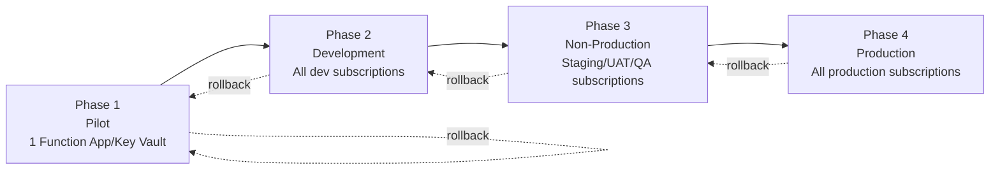

# Enterprise Rollout Strategy

Scope: hundreds of Function Apps / Key Vaults across multiple Azure subscriptions. This plan assumes `Testing.md`'s single pilot pair has already passed all success criteria.

## Phasing overview

Each phase gates the next via explicit **Validation Gates** and **Exit Criteria** (below) — a phase does not start on a calendar date, it starts when the prior phase's exit criteria are signed off.

---

## Phase 1 — Pilot

**Scope**: the single Function App / Key Vault pair from `Testing.md`, plus 2–4 additional low-risk pairs in the same subnet to prove the "subnet-by-subnet, batch after the first" pattern from Design.md §2.5.

**Duration**: 1–2 weeks including the 24–48h observation window per Testing.md.

**Activities**:
- Execute `Testing.md` in full for the primary pilot pair.
- Repeat the validated pattern for the additional pilot-batch pairs on the same subnet.
- Deploy Azure Policy initiative in `Audit`/`DoNotEnforce` mode only, scoped to the pilot subscription — no enforcement yet, purely to generate compliance visibility and confirm the policies themselves work as intended without blocking anything.
- Deploy monitoring (Diagnostic Settings + Activity Log Alerts + Action Groups) for the pilot scope and confirm alerts fire correctly (test by deliberately triggering one, e.g., a firewall change in a sandboxed vault).

**Validation Gate to exit Phase 1**: all `Testing.md` success criteria met for every pilot pair; no unresolved Sev1/Sev2 incidents attributable to the migration; monitoring confirmed working; rollback demonstrated at least once (real or drilled).

---

## Phase 2 — Development

**Scope**: all Function App / Key Vault pairs in Development-tier subscriptions, across all subnets/VNets in that tier.

**Duration**: 3–6 weeks depending on estate size in Dev, executed subnet-by-subnet per Design.md §2.5.

**Activities**:
- Roll the validated pattern out subnet by subnet across all Dev subscriptions.
- Move Azure Policy initiative to `Audit` mode fully enabled (still not `Deny`) at Dev subscription scope, to surface any non-compliant Key Vaults ahead of enforcement.
- Track a migration burndown (Key Vaults migrated vs. remaining) visible to the platform team and stakeholders.
- Begin retiring old PE-based monitoring/alerting for fully-migrated Dev Key Vaults only after their replacement monitoring is confirmed (avoid a visibility gap).

**Validation Gate to exit Phase 2**: ≥ 95% of in-scope Dev Key Vaults migrated (remaining 5% explicitly triaged as exclusions or blocked with a documented reason, not silently skipped); zero unresolved access-breaking incidents older than 48 hours; Policy audit shows expected compliance level.

---

## Phase 3 — Non-Production (Staging/UAT/QA)

**Scope**: all Function App / Key Vault pairs in Non-Production subscriptions.

**Duration**: 4–8 weeks — slower pace than Dev, since Non-Prod is used for release validation by other teams and disruption here has downstream schedule impact.

**Activities**:
- Same subnet-by-subnet approach, now with a **formal change window** per subnet/batch (coordinate with release calendars for any team using Non-Prod for active UAT).
- Move Azure Policy initiative to enforced `Deny` mode for the migrated portion of Non-Prod, `Audit` for not-yet-migrated portion (scoped via the initiative's exemption mechanism, Design.md §7).
- Full CAB submission for the Non-Prod rollout as a single change record referencing the phase plan, not one CAB item per Key Vault (see Change Management below).
- Load/performance validation: confirm no latency regression under realistic Non-Prod traffic patterns, since this is the first phase with production-representative load.

**Validation Gate to exit Phase 3**: 100% of in-scope Non-Prod Key Vaults migrated or explicitly excluded with sign-off; enforced Policy shows no unexpected denies; two consecutive weeks with zero migration-attributable incidents; CAB retrospective completed with no unresolved action items.

---

## Phase 4 — Production

**Scope**: all Function App / Key Vault pairs in Production subscriptions, across all subscriptions in the multi-subscription estate.

**Duration**: 8–16+ weeks depending on total Production estate size — this phase should be the slowest and most conservative, batched by business unit/workload criticality, least-critical first.

**Activities**:
- Subnet-by-subnet, but additionally **workload-criticality ordered**: begin with lowest business-impact Production workloads, defer highest-criticality/highest-compliance-sensitivity Key Vaults to last (or to the explicit exclusion list from Design.md §4.4 if a genuine case for remaining on Private Endpoint exists).
- Every batch requires a **formal CAB-approved change window** with a named on-call owner for the window and the 24–48h post-window observation period.
- Azure Policy initiative reaches full `Deny` enforcement across all migrated Production scope; `Audit` for any remaining unmigrated portion until it too is complete.
- Only after a full Production subscription is 100% migrated (or exclusions signed off) are that subscription's Private Endpoint restore snapshots (`scripts/migration/snapshots/`) formally archived rather than kept hot for immediate rollback — the `Restore-PrivateEndpoint.ps1` script itself is never removed (retained per Architecture.md §7 rollback strategy for the exclusion-list Key Vaults, which still use Private Endpoint indefinitely).

**Validation Gate to exit Phase 4 (= migration complete)**: 100% of in-scope Production Key Vaults migrated or on the signed-off exclusion list; full Policy enforcement active tenant-wide for in-scope subscriptions; four consecutive weeks with zero migration-attributable Production incidents; final compliance report issued to stakeholders (BusinessImplementationPlan.md success metrics).

---

## Change Management & CAB Approval

- **One CAB submission per phase-batch** (e.g., "Phase 3, Batch 4: Subnets X, Y, Z"), not per Key Vault — hundreds of individual CAB tickets is itself an operational risk (approval fatigue leading to rubber-stamping) and doesn't match the actual unit of change (a subnet's worth of Key Vaults sharing one Service Endpoint enablement).
- Each CAB submission includes: scope (exact Key Vault list, generated from the discovery inventory, not manually typed), the validated Testing.md pattern reference, rollback plan reference (Architecture.md §7), and the named on-call owner for the change window.
- Production phase (Phase 4) batches additionally require: a peer technical review of the exact migration script invocation and target scope (the batch's Key Vault/subnet list, generated from discovery, not hand-typed) before execution, and sign-off from the affected workload's product/service owner, not just the platform team.

## Communication Plan

| Audience | What | When | Channel |
|---|---|---|---|
| Platform/Cloud Engineering team | Full technical detail, burndown tracking | Continuous (dashboard) + weekly sync | Internal wiki/dashboard, standup |
| Workload/application teams whose Function Apps are affected | Which of their Key Vaults are migrating, when, what to expect, who to contact | 1 week before their batch's change window, and again on the day | Email/Teams to team distribution list |
| Security/Compliance stakeholders | Policy compliance status, exclusion list, risk acceptance record | Per-phase exit gate | Formal report (BusinessImplementationPlan.md metrics) |
| Executive sponsors | Progress against timeline, blockers, budget/cost impact | Per-phase exit gate | Executive summary (BusinessImplementationPlan.md) |
| All-hands / broader engineering org | High-level awareness that this migration is happening (reduces "why did my Key Vault access change" surprise tickets) | Phase 1 kickoff, Phase 4 kickoff | Company-wide engineering announcement |

## Rollback Plan (phase level)

- **Batch-level rollback**: per Architecture.md §7 — reversible per Key Vault via the `Restore-*` migration scripts and that Key Vault's saved snapshot, without needing to roll back the whole phase.
- **Phase-level pause**: if a systemic issue is found (not isolated to one Key Vault — e.g., a Service Endpoint behavior difference discovered that affects many vaults at once), halt the current phase's remaining batches, do not proceed to the next phase, and triage before resuming. The already-migrated portion of the current phase is evaluated case-by-case (roll back individually vs. hold in place) based on the nature of the issue.
- **Full program pause**: reserved for a critical, unresolved systemic issue (e.g., an Azure platform-level behavior change affecting Service Endpoints broadly) — halt all phases, revert to Private Endpoint for any Key Vault mid-transition, and re-baseline the plan before resuming.

## Validation Gates (summary, detailed per-phase above)

Every phase exit requires: technical success criteria (Testing.md-derived), zero unresolved migration-attributable incidents above a defined severity, Policy compliance at the expected level for that phase, and explicit sign-off from the phase owner — no phase advances on a calendar deadline alone.

## Exit Criteria (program-level)

The program is complete when: 100% of in-scope Key Vaults (i.e., excluding the documented, signed-off exclusion list) are migrated to Service Endpoints with `default_action = Deny`; zero Private Endpoints remain on in-scope Key Vaults; full Azure Policy initiative enforcement is active across all in-scope subscriptions; monitoring/alerting is fully operational; and a final compliance/closure report is delivered to stakeholders.

## Risks and Mitigations (rollout-specific, in addition to Architecture.md §6)

| Risk | Mitigation |
|---|---|
| Migration fatigue / rushed batches late in Phase 4 to hit a deadline | Exit criteria are outcome-based, not date-based; explicitly resource the program to avoid deadline pressure overriding validation gates |
| Undiscovered dependency surfaces only in Production (e.g., an on-prem consumer missed in discovery) | Phase 3 (Non-Prod) load/pattern validation is designed specifically to catch this before Phase 4; discovery inventory (Design.md §1) is re-validated per subscription immediately before that subscription's batch, not just once at program start |
| Cross-team coordination overhead (hundreds of workload teams potentially affected) | Communication Plan above; a single point of contact (platform team) owns scheduling, not each workload team self-serving migration timing |
| Policy enforcement turned on too early, blocking legitimate in-flight work | Phased Policy effect (`DoNotEnforce` → `Audit` → `Deny`) tracks one phase behind the migration phase itself, never ahead of it |
